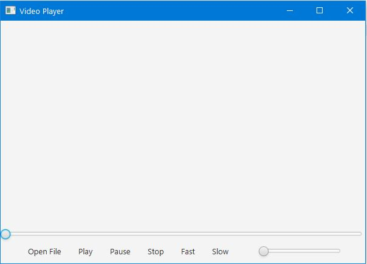
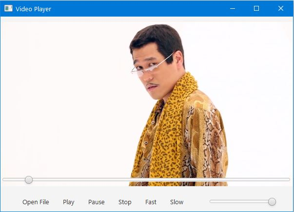

# Video-Player
Basic video player implemented in Java. The UI was designed in JavaFX using an FXML file.
It can open, play, pause, stop, slow-down, fast-forward, and change the volume level of an MP4 video.
On a double click the video will expand to full-screen mode.

To run the project, simply run Main.java that contains the main method.

## How to use
### 1. Open the player

### 2. Click open file, select the video and enjoy

